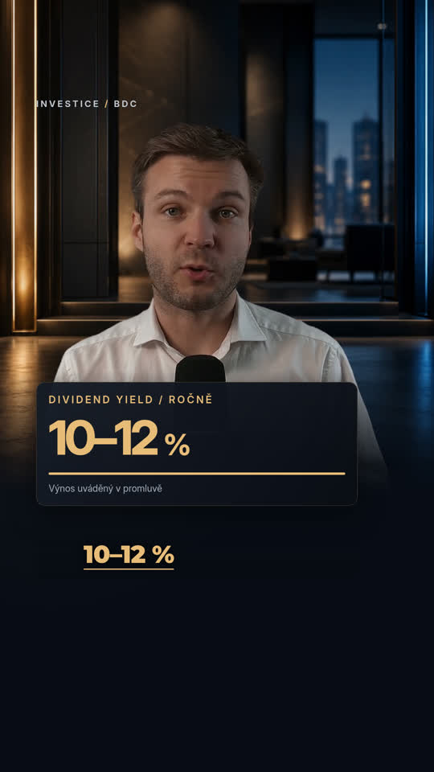

# Direct-upload Reel v5 — NO BACKGROUND MUSIC

[Download latest MP4](reel-direct-no-music-v5.mp4): open it and choose **Download raw file**.

1080 × 1920 · 60 fps · 34.7 s. Presenter footage and original voice regenerated directly from the latest user upload. Smoothed face tracking, vertical composition, short animated Czech Montserrat captions, contextual finance graphics, illustrated Capitol cutaway and a full-screen 17-year comparison.

Audio contains only the original cleaned voice and restrained, short sound effects. No background music layer.

[Czech subtitle file](reel-direct-v5.cs.srt)

Timing uses speech recognition without human-listening verification. Instagram UI varies by device and expanded captions; overlays use a conservative reserve. Capitol is a labeled illustration; the Andrew Sharp card is prepared from the supplied visual reference.

Prior exports remain available: [v4](reel-instagram-v4.mp4), [v3](reel-retention-v3.mp4), [v2](reel-premium-60fps.mp4), [v1](reel.mp4).
