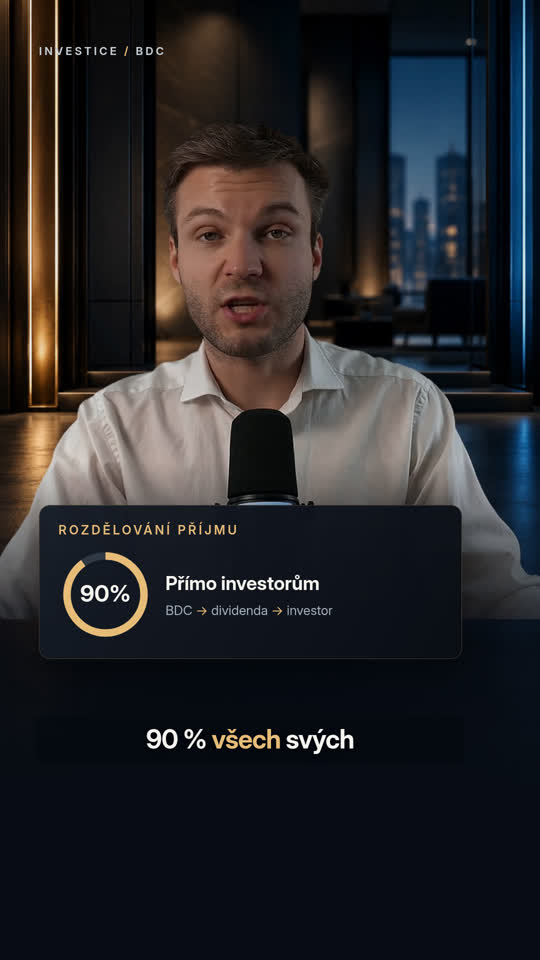

# Reel – přepracovaná verze

[Stáhnout nové MP4 v 60 fps](reel-premium-60fps.mp4) · [České titulky SRT](reel-premium.cs.srt)

Na stránce MP4 použijte **Download raw file**.

Nový edit: 1080 × 1920, 60 fps, 34,7 sekundy. České titulky se zvýrazněním slov, nové tmavé studio, obsahové karty BDC, animace rozdělení 90 % příjmu, srovnání 17 let / S&P 500, ilustrační záběr Kongresu, upravený hlas, původní instrumentální hudba a decentní sound design.

Původní export je zachován jako `reel.mp4`.

Poznámka: Studio a ilustrační záběr Kongresu jsou generované vizuály. Číselná tvrzení vycházejí z promluvy; edit nedoplňuje neexistující historická data. Původní záběr řečníka má rozlišení 1280 × 720.
