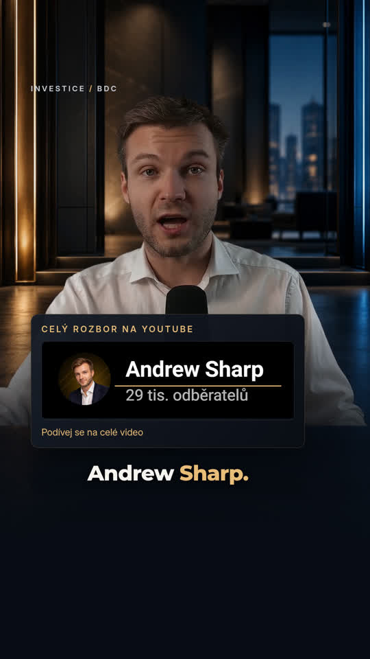

# Instagram Reel — v4

[Download latest video](reel-instagram-v4.mp4) — open and choose **Download raw file**.

1080 × 1920, 60 fps, 34.7 seconds. Same professional gold/charcoal visual identity and speech edit, with more natural presenter framing, larger captions raised into a conservative Instagram UI reserve, restrained animations, refined information cards and subtle sound design.

Caption timing is based on speech recognition; it has not been verified by human listening. Instagram UI varies by device and expanded captions. The Andrew Sharp card is a prepared reference asset from the supplied screenshot, not a pixel-exact original.

[Czech captions](reel-instagram-v4.cs.srt) · [Previous v3](reel-retention-v3.mp4) · [v2](reel-premium-60fps.mp4) · [v1](reel.mp4)
