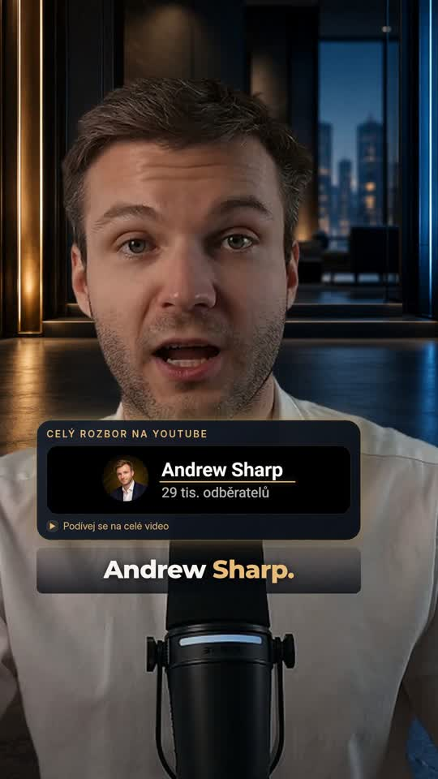

# Reel v7 — contextual cutaways and channel glow

[Download latest MP4](reel-broll-glow-v7.mp4) — open and choose **Download raw file**.

1080 × 1920 · 60 fps · 34.7 seconds. Large tracked original presenter with two short contextual illustrative cutaways: a designed BDC statutory-document detail and an illustrated Capitol scene with animated camera movement. Andrew Sharp channel card now has rounded edges, a restrained animated gold glow, a light sweep and a perspective entrance. Original voice and light sound effects only; no music.

[Czech captions](reel-broll-v7.cs.srt) · [Previous v6](reel-full-no-music-v6.mp4)

The cutaways are illustrative animations, not licensed live-action stock or authentic document scans. Caption timing is based on recognition without human-listening verification. The source is 720p and is upscaled. The channel card is prepared from the supplied visual reference.
