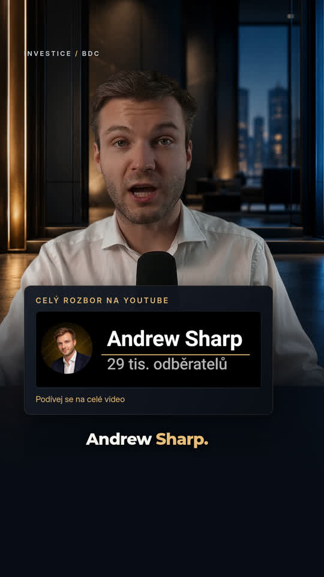

# Reel v3 – kinetické titulky a rozšířená grafika

[Nové MP4 v3](reel-retention-v3.mp4) · [České titulky SRT](reel-retention-v3.cs.srt)

Na stránce souboru klikněte na **Download raw file**.

1080 × 1920, 60 fps, 34,7 sekundy. Montserrat ExtraBold, krátké významové titulky, odhalování slov podle časování řeči, selektivní zvýraznění a animované podtržení. Rozšířené dividendové countery, money-flow, časová osa 17 let, burzovní a legislativní panely. Karta Andrew Sharp připravená podle dodané reference, důraz na název kanálu. Reframing, jemné punch-in změny, doplněné zvukové akcenty.

Předchozí verze zůstávají zachované: [v2](reel-premium-60fps.mp4), [v1](reel.mp4).

Pozadí a ilustrační záběr Kongresu jsou generované vizuály. Karta kanálu byla připravena z dodané obrazové reference; nejde o nezměněnou kopii původního screenshotu. Čísla vycházejí z promluvy, grafiky nepřidávají vymyšlené ceny akcií ani historická výnosová data.
