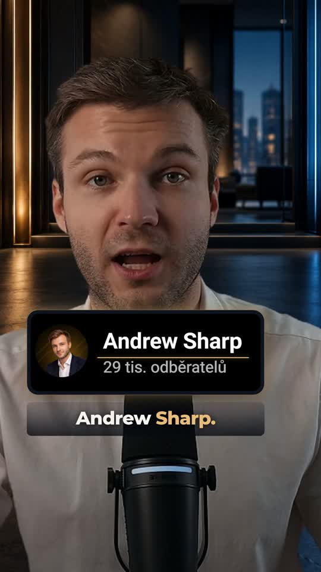

# Reel v8 — one-line captions and larger channel card

[Download latest MP4](reel-single-line-v8.mp4) — open and choose **Download raw file**.

1080 × 1920 · 60 fps · 34.7 seconds. 39 short caption pages, all constrained to a single line and measured in Montserrat 62 px. One B-roll only: the illustrated Capitol cutaway. The Andrew Sharp image fills a larger 256-pixel-high rounded card, with stronger smooth entrance, light sweep and restrained gold glow. Original voice and quiet sound effects; no music.

[Czech captions](reel-single-line-v8.cs.srt) · [Previous v7](reel-broll-glow-v7.mp4)

The Capitol is illustrative. Caption timing is recognition-based without human listening verification. Source is upscaled from 720p; the channel card is prepared from the supplied reference.
